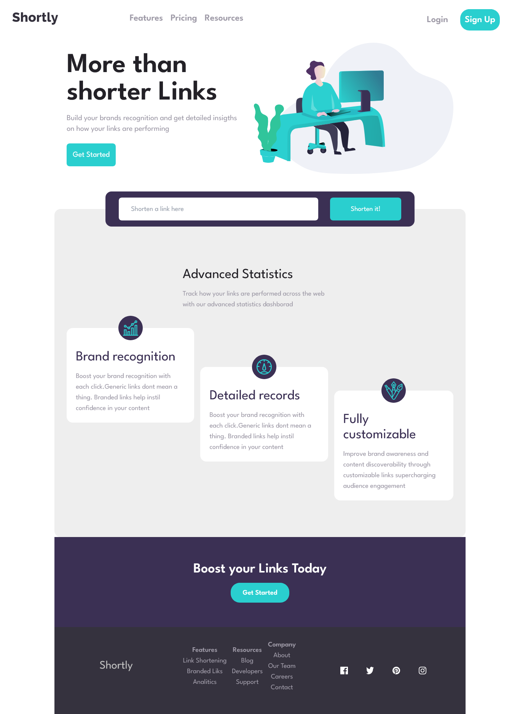

# Frontend Mentor - Job listings with filtering solution

This is a solution to the [Job listings with filtering challenge on Frontend Mentor](https://www.frontendmentor.io/challenges/job-listings-with-filtering-ivstIPCt). Frontend Mentor challenges help you improve your coding skills by building realistic projects.

## Table of contents

- [The challenge](#the-challenge)
- [Screenshot](#screenshot)
- [Links](#links)
- [Built with](#built-with)
- [What I learned](#what-i-learned)
- [Continued development](#continued-development)

### The challenge

Users should be able to:

- View the optimal layout for the site depending on their device's screen size
- See hover states for all interactive elements on the page
- Filter job listings based on the categories

### Screenshot

### Links

- Solution URL: [https://github.com/Elmomero/FM-url-shortener-app](https://github.com/Elmomero/FM-url-shortener-app)
- Live Site URL: [https://elmomero.github.io/FM-url-shortener-app/](https://elmomero.github.io/FM-url-shortener-app/)

### Built with

- Semantic HTML5 markup
- TailwindCss
- Flexbox
- Mobile-first workflow
- TS library

### What I learned

I learned how to combine vanilla typescript and TailwindCss to create a web application.

### Continued development

I want to make proyects like this but using a Typescript framework
like React to have a faster develoment
